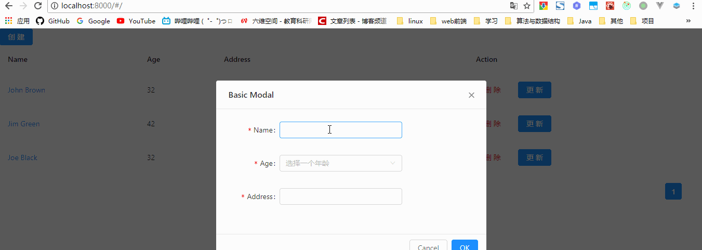

# Dva -> antd
antd建议使用的工具就是dva，我们按照官网的步骤来进行项目创建。  
```
npm i -g dva-cli
dva new myapp
cd myapp
npm install --save antd
```
修改.roudhogrc
```json
{
  "entry": "src/index.js",
  "env": {
    "development": {
      "extraBabelPlugins": [
        "dva-hmr",
        "transform-runtime",
		["import", { "libraryName": "antd", "style": "css" }]
      ]
    },
    "production": {
      "extraBabelPlugins": [
        "transform-runtime",
		["import", { "libraryName": "antd", "style": "css" }]
      ]
    }
  }
}

```
启动
```
npm start
```
结合上一节dva的使用，应该可以很快就能用dva开发antd。
# Demo
这个工程则是展示了一个用户列表的本地增删改查。

