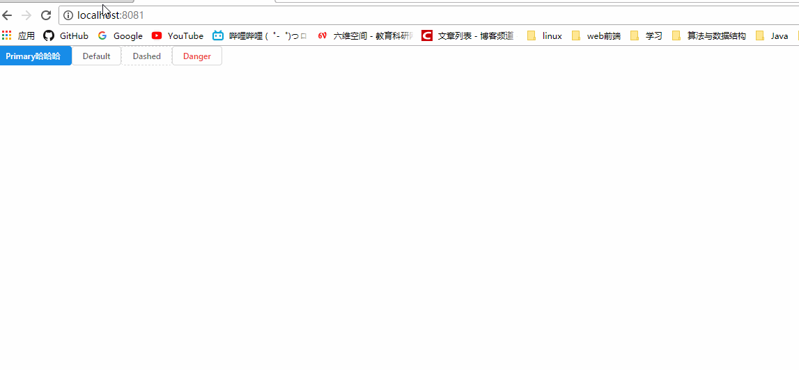

# 快速开始
1 全局安装webpack
```
npm install -g webpack webpack-dev-server
```
2 安装项目需要的依赖
```
npm install
```
3 运行webpack-dev-server
```
webpack-dev-server
```
4 8080端口（如果被占用则8081）下打开浏览器


5 查看其它组件的效果直接替换main.jsx中react以下的内容

